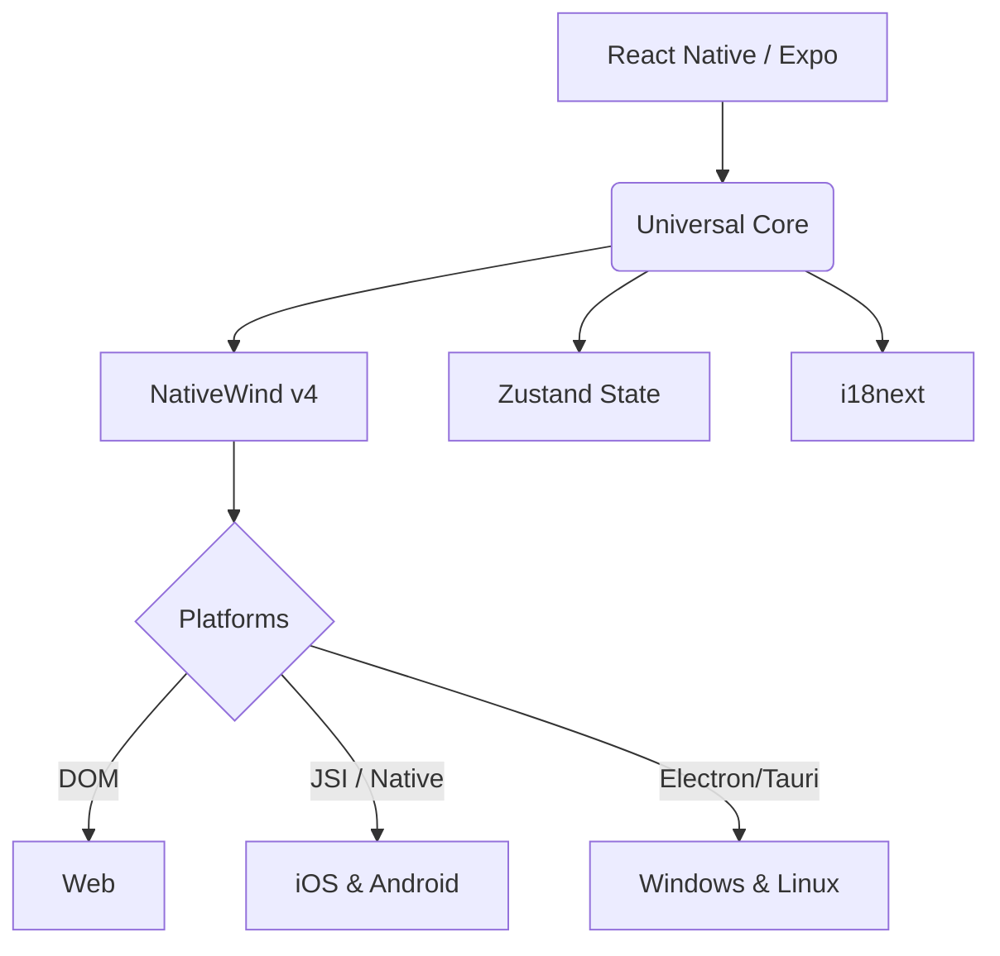
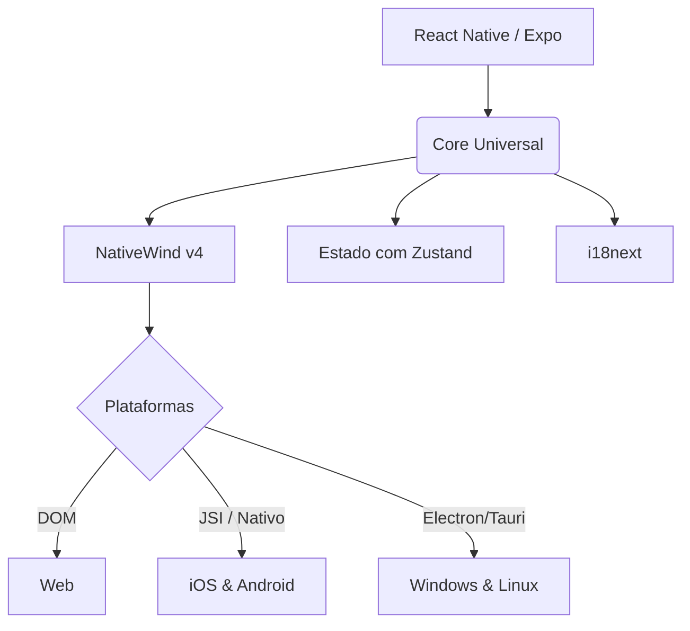

  
  <h1>Portfolio Builder</h1>
  
<b>Automate the creation of stunning portfolios, READMEs, and resumes in one place.</b>

  
  

    <a href="#english">🇬🇧 English</a> &nbsp;&nbsp;|&nbsp;&nbsp; 
    <a href="#português-br">🇧🇷 Português (BR)</a>
  

---

## The Idea

**Portfolio Builder** is an open-source, universal application designed to completely automate and simplify how developers showcase their work. 

Instead of manually crafting an HTML/CSS portfolio, struggling with a generic template, or spending hours writing a README and updating a CV, this tool acts as a **central hub**:
1. **Portfolio Generator**: Import your GitHub repositories, choose your tech stack, and generate a beautiful, responsive portfolio.
2. **README Generator**: Standardize and generate high-quality `.md` documentation for your open-source projects.
3. **Resume (CV) Generator**: Export your technical profile directly to a clean, ATS-friendly PDF.

Under the hood, the architecture is designed to support semantic data processing—parsing your raw repositories and commit history to synthesize compelling project descriptions with minimal manual intervention.

### Motivation
The main motivation behind Portfolio Builder is simple: **Developers should spend their time coding, not designing their own portfolios from scratch every year.** We wanted to create an out-of-the-box, premium-looking experience that highlights what really matters: your code and your projects. Far from subscriptions or intrusive ads. Even better: with built-in integrations for the tools you use daily.

## Methodology & Structure

The project is built on a **Universal Architecture** (write once, run anywhere). It shares a single codebase for Web, Android, iOS, and Desktop platforms. 

## Technologies

- **Framework**: [Expo](https://expo.dev/) (SDK 57) / [React Native](https://reactnative.dev/)
- **Styling**: [NativeWind v4](https://www.nativewind.dev/) (Tailwind CSS universal)
- **State Management**: [Zustand](https://github.com/pmndrs/zustand) (Persistent Local Storage)
- **Routing**: [Expo Router](https://docs.expo.dev/router/introduction/) (File-based routing)
- **Schema Validation**: [Zod](https://zod.dev/)
- **Internationalization (i18n)**: [i18next](https://www.i18next.com/) & `expo-localization`

## Availability Checklist

Our goal is to make Portfolio Builder natively available across all major platforms. Track our progress below:

- [ ] **Web** (PWA & Web App)
- [ ] **PlayStore** (Android)
- [ ] **AppStore** (iOS / iPadOS)
- [ ] **Linux** 
- [ ] **Windows** 

## 🔌 Supported Integrations

- [ ] **GitHub**: Auto-import repositories, stats, and languages.
- [ ] **Figma**: Embed design prototypes and UI showcases.
- [ ] **LinkedIn**: Sync professional experience and generate PDF CVs.
- [ ] **Medium / Dev.to**: Auto-fetch your latest articles and blog posts.
- [ ] **WakaTime**: Display real-time coding stats and habits.
- [ ] **Notion**: Export or sync your portfolio data to a Notion database.

## Open Source & Contributing

This project is open-source. 
Pull Requests are welcome. To contribute bug fixes, new AI model integrations, or templates, please fork the repository and submit your PR for review.

---

  

# Versão em Português

## A Ideia

O **Portfolio Builder** é uma aplicação universal de código aberto projetada para automatizar e simplificar completamente como desenvolvedores apresentam seu trabalho.

Em vez de criar manualmente um portfólio em HTML/CSS, lutar com templates genéricos, ou gastar horas escrevendo um README e atualizando um currículo, esta ferramenta atua como um **hub central**:
1. **Gerador de Portfólio**: Importe seus repositórios do GitHub, escolha suas tecnologias e gere um portfólio bonito e responsivo.
2. **Gerador de README**: Padronize e gere documentação `.md` de alta qualidade para seus projetos open-source.
3. **Gerador de Currículo (CV)**: Exporte seu perfil técnico diretamente para um PDF limpo e amigável para ATS (sistemas de RH).

Sob o capô, a arquitetura foi projetada para suportar processamento semântico de dados — interpretando seus repositórios e histórico de commits para sintetizar automaticamente descrições e métricas com o mínimo de intervenção manual.

### Motivação
A principal motivação por trás do Portfolio Builder é simples: **Desenvolvedores devem gastar seu tempo programando, não desenhando seus próprios portfólios do zero todo ano.** Queríamos criar uma experiência premium, pronta para uso, que destaque o que realmente importa: seu código e seus projetos. Longe de assinaturas e propagandas. E melhor: com integrações diretas às ferramentas usadas no seu dia a dia.

## Metodologia e Estrutura

O projeto é construído em uma **Arquitetura Universal** (escreva uma vez, rode em qualquer lugar). Ele compartilha uma base de código única para as plataformas Web, Android, iOS e Desktop.

## Tecnologias

- **Framework**: [Expo](https://expo.dev/) (SDK 57) / [React Native](https://reactnative.dev/)
- **Estilização**: [NativeWind v4](https://www.nativewind.dev/) (Tailwind CSS universal)
- **Gerenciamento de Estado**: [Zustand](https://github.com/pmndrs/zustand) (Armazenamento Local Persistente)
- **Roteamento**: [Expo Router](https://docs.expo.dev/router/introduction/) (Roteamento baseado em arquivos)
- **Validação de Schema**: [Zod](https://zod.dev/)
- **Internacionalização (i18n)**: [i18next](https://www.i18next.com/) & `expo-localization`

## Checklist de Disponibilidade

Nosso objetivo é tornar o Portfolio Builder disponível nativamente em todas as principais plataformas. Acompanhe nosso progresso:

- [ ] **Web** (PWA & Web App)
- [ ] **PlayStore** (Android)
- [ ] **AppStore** (iOS / iPadOS)
- [ ] **Linux** 
- [ ] **Windows** 

## 🔌 Integrações Suportadas

- [ ] **GitHub**: Importação automática de repositórios, estatísticas e linguagens.
- [ ] **Figma**: Inserção de protótipos de design e vitrines de UI interativas.
- [ ] **LinkedIn**: Sincronização de experiências profissionais e geração de CV em PDF.
- [ ] **Medium / Dev.to**: Busca automática dos seus artigos e tutoriais mais recentes.
- [ ] **WakaTime**: Exibição de estatísticas e hábitos de programação em tempo real.
- [ ] **Notion**: Exportação ou sincronização dos dados do portfólio para uma base do Notion.

## Open Source e Contribuição

Este projeto é de código aberto. 
Pull Requests são bem-vindos. Para contribuir com correções de bugs, novas integrações de IA ou novos templates, faça um _fork_ do repositório e submeta seu PR para revisão.
