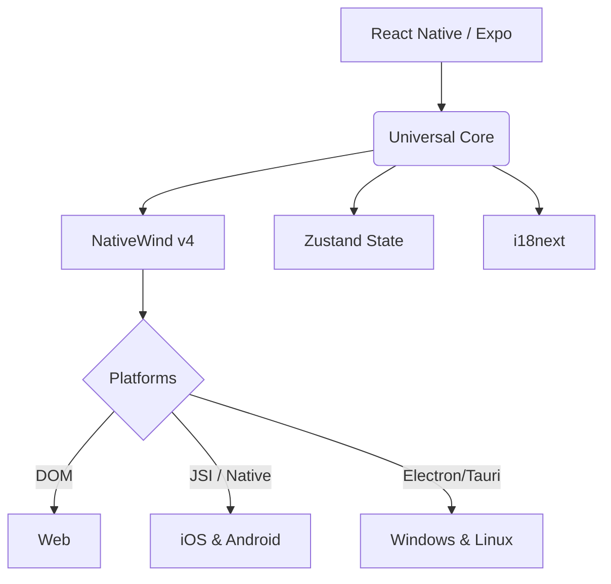
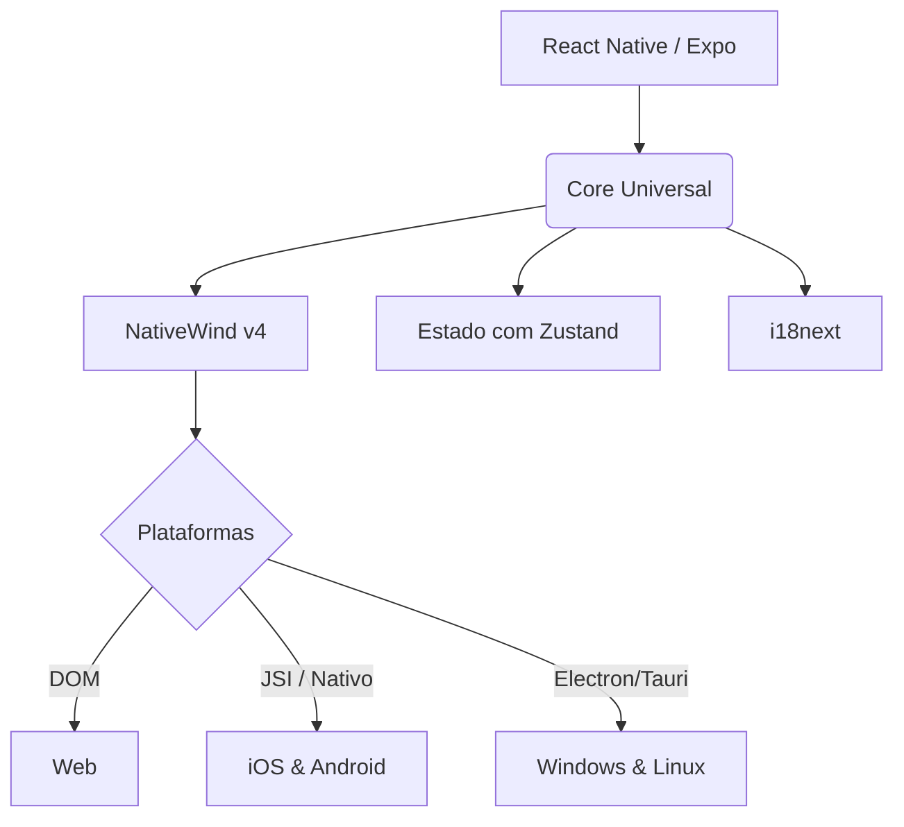

  
  <h1>🌟 Portfolio Builder</h1>
  
<b>Automate the creation of stunning portfolios, READMEs, and resumes in one place.</b>

  
  

    <a href="#english">🇬🇧 English</a> &nbsp;&nbsp;|&nbsp;&nbsp; 
    <a href="#português-br">🇧🇷 Português (BR)</a>
  

---

## 🚀 The Idea

**Portfolio Builder** is an open-source, universal application designed to completely automate and simplify how developers showcase their work. 

Instead of manually crafting an HTML/CSS portfolio, struggling with a generic template, or spending hours writing a README and updating a CV, this tool acts as a **central hub**:
1. **Portfolio Generator**: Import your GitHub repositories, choose your tech stack, and generate a beautiful, responsive portfolio.
2. **README Generator**: Standardize and generate high-quality `.md` documentation for your open-source projects.
3. **Resume (CV) Generator**: Export your technical profile directly to a clean, ATS-friendly PDF.

### 💡 Motivation
The main motivation behind Portfolio Builder is simple: **Developers should spend their time coding, not designing their own portfolios from scratch every year.** We wanted to create an out-of-the-box, premium-looking experience that highlights what really matters: your code and your projects.

## 🛠 Methodology & Structure

The project is built on a **Universal Architecture** (write once, run anywhere). It shares a single codebase for Web, Android, iOS, and Desktop platforms. 

## 💻 Technologies

- **Framework**: [Expo](https://expo.dev/) (SDK 57) / [React Native](https://reactnative.dev/)
- **Styling**: [NativeWind v4](https://www.nativewind.dev/) (Tailwind CSS universal)
- **State Management**: [Zustand](https://github.com/pmndrs/zustand) (Persistent Local Storage)
- **Routing**: [Expo Router](https://docs.expo.dev/router/introduction/) (File-based routing)
- **Schema Validation**: [Zod](https://zod.dev/)
- **Internationalization (i18n)**: [i18next](https://www.i18next.com/) & `expo-localization`

## 🎯 Availability Checklist

Our goal is to make Portfolio Builder natively available across all major platforms. Track our progress below:

- [ ] **Web** (PWA & Web App)
- [ ] **PlayStore** (Android)
- [ ] **AppStore** (iOS / iPadOS)
- [ ] **Linux** 
- [ ] **Windows** 

## 🤝 Open Source & Contributing

This project is entirely **Open Source**. We believe that community collaboration builds the best developer tools.

**We gladly accept Pull Requests (PRs)!** 
Whether you want to fix a bug, add a new AI model integration for descriptions, or create a new template for the generated portfolios, feel free to fork the repository and submit your PR.

---

  

# 🇧🇷 Versão em Português

## 🚀 A Ideia

O **Portfolio Builder** é uma aplicação universal de código aberto projetada para automatizar e simplificar completamente como desenvolvedores apresentam seu trabalho.

Em vez de criar manualmente um portfólio em HTML/CSS, lutar com templates genéricos, ou gastar horas escrevendo um README e atualizando um currículo, esta ferramenta atua como um **hub central**:
1. **Gerador de Portfólio**: Importe seus repositórios do GitHub, escolha suas tecnologias e gere um portfólio bonito e responsivo.
2. **Gerador de README**: Padronize e gere documentação `.md` de alta qualidade para seus projetos open-source.
3. **Gerador de Currículo (CV)**: Exporte seu perfil técnico diretamente para um PDF limpo e amigável para ATS (sistemas de RH).

### 💡 Motivação
A principal motivação por trás do Portfolio Builder é simples: **Desenvolvedores devem gastar seu tempo programando, não desenhando seus próprios portfólios do zero todo ano.** Queríamos criar uma experiência premium, pronta para uso, que destaque o que realmente importa: seu código e seus projetos.

## 🛠 Metodologia e Estrutura

O projeto é construído em uma **Arquitetura Universal** (escreva uma vez, rode em qualquer lugar). Ele compartilha uma base de código única para as plataformas Web, Android, iOS e Desktop.

## 💻 Tecnologias

- **Framework**: [Expo](https://expo.dev/) (SDK 57) / [React Native](https://reactnative.dev/)
- **Estilização**: [NativeWind v4](https://www.nativewind.dev/) (Tailwind CSS universal)
- **Gerenciamento de Estado**: [Zustand](https://github.com/pmndrs/zustand) (Armazenamento Local Persistente)
- **Roteamento**: [Expo Router](https://docs.expo.dev/router/introduction/) (Roteamento baseado em arquivos)
- **Validação de Schema**: [Zod](https://zod.dev/)
- **Internacionalização (i18n)**: [i18next](https://www.i18next.com/) & `expo-localization`

## 🎯 Checklist de Disponibilidade

Nosso objetivo é tornar o Portfolio Builder disponível nativamente em todas as principais plataformas. Acompanhe nosso progresso:

- [ ] **Web** (PWA & Web App)
- [ ] **PlayStore** (Android)
- [ ] **AppStore** (iOS / iPadOS)
- [ ] **Linux** 
- [ ] **Windows** 

## 🤝 Open Source e Contribuição

Este projeto é inteiramente **Open Source**. Acreditamos que a colaboração da comunidade constrói as melhores ferramentas para desenvolvedores.

**Nós aceitamos Pull Requests (PRs) com prazer!** 
Seja para corrigir um bug, adicionar uma nova integração de modelo de IA para descrições, ou criar um novo template para os portfólios gerados, sinta-se à vontade para fazer um _fork_ do repositório e enviar seu PR.
