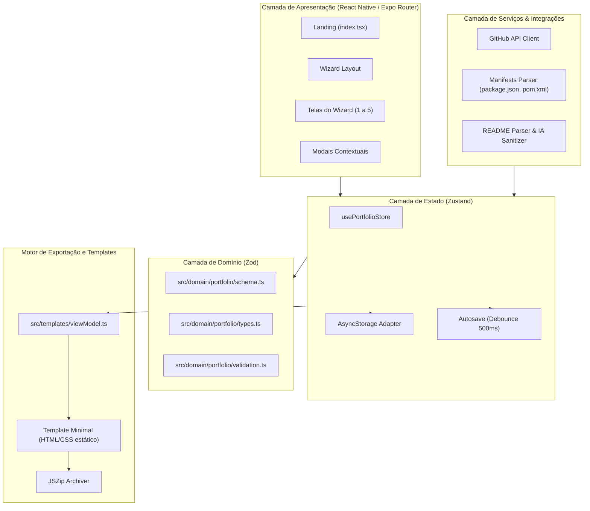

# Portfolio Builder — Arquitetura de Software e Fluxo de Dados

Este documento detalha o funcionamento interno, separação de camadas e fluxo de dados do **Portfolio Builder**.

---

## 1. Visão Arquitetural em Camadas

---

## 2. Ciclo de Vida da Sessão (`PortfolioSession`)

1. **Inicialização Local:**
   - Na abertura do app, `usePortfolioStore` hidrata o estado a partir do `AsyncStorage` (`portfolio-builder:session:v1`).
   - Se nenhuma sessão existir, `createDefaultSession()` gera uma estrutura inicial em conformidade estrita com o Zod.
2. **Mutação Imutável:**
   - Todas as alterações (edição de perfil, adição de repositórios, seleção de temas) ocorrem através de actions dedicadas (`updateProfile`, `addProjects`, `updatePortfolioConfig`).
   - Cada mutação atualiza `metadata.updatedAt` e dispara um autosave assíncrono com debounce de 500ms.
3. **Exportação de Sessão:**
   - O usuário pode exportar o arquivo `.json` completo a qualquer momento e importá-lo em outro navegador ou dispositivo sem perder nenhum dado.

---

## 3. Isolamento da Renderização (Template vs Client Bundle)

Uma premissa central de engenharia do Portfolio Builder é que **o portfólio exportado não carrega React, Expo ou dependências pesadas de bundle**:
- O `viewModel.ts` extrai apenas os dados visíveis e necessários.
- O template produz HTML5 semântico, CSS puro com variáveis modernas e JavaScript vanilla de no máximo alguns kilobytes para interatividade leve (menu mobile, animações suaves).
- O resultado é uma pontuação **100/100 no Google PageSpeed / Lighthouse** com carregamento instantâneo.
