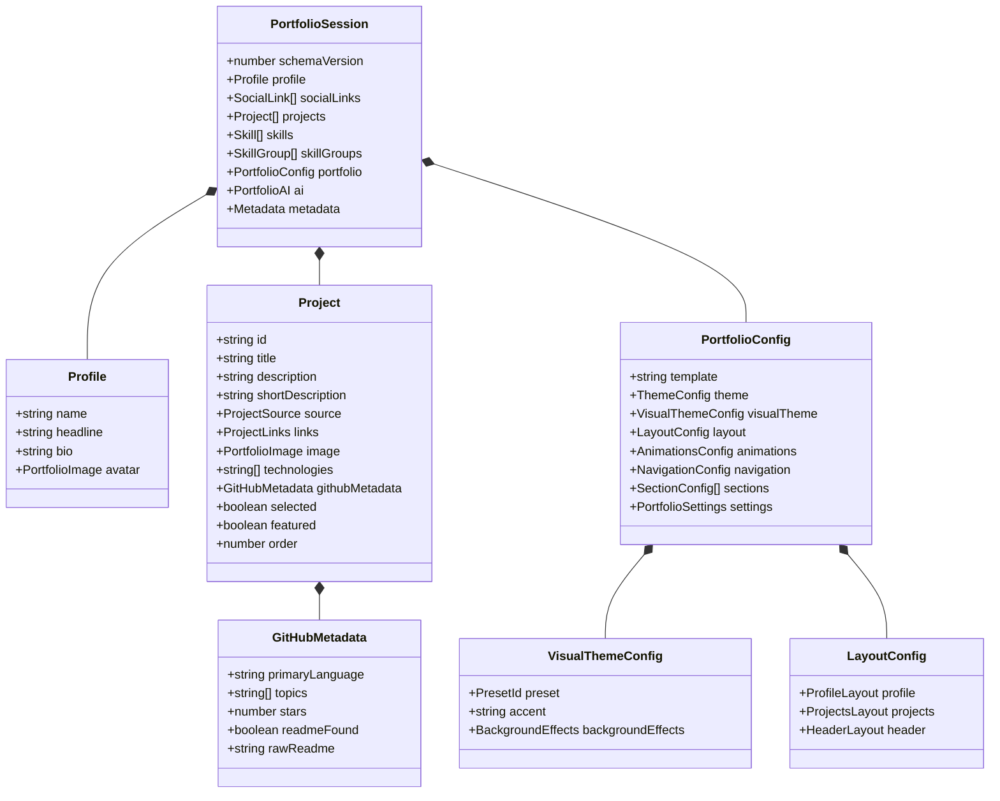
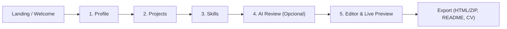

# Portfolio Builder — Source of Truth (Fonte Única da Verdade)

Este documento representa o **Source of Truth (SoT)** absoluto e detalhado da aplicação **Portfolio Builder**. Ele consolida todos os conceitos de arquitetura, domínio, fluxo de dados, modelos de renderização, internacionalização, sistema de temas e integração com agentes.

---

## 1. Visão Geral do Produto

O **Portfolio Builder** é uma aplicação multiplataforma e open-source construída para desenvolvedores. O objetivo central é eliminar a necessidade de criar portfólios manuais do zero a cada ano.

A ferramenta atua como um **Hub de Identidade Profissional**:
1. **Centralização de Dados:** O usuário insere ou importa suas informações técnicas uma única vez.
2. **Multi-Exportação:** A partir de uma mesma sessão (`PortfolioSession`), o sistema gera:
   - **Portfólio Web Estático:** HTML/CSS puro, responsivo, acessível, sem frameworks no bundle final, pronto para GitHub Pages, Vercel ou Netlify.
   - **GitHub Profile README:** Markdown estruturado com badges dinâmicas, seções e destaques de repositórios.
   - **Currículo Técnico (PDF/ATS):** Documento limpo, formatado e legível para sistemas de recrutamento.
3. **Privacidade Absoluta (Local-First):** Não exige login ou banco de dados externo proprietário. Todo o estado vive no dispositivo do usuário (`AsyncStorage`) e pode ser exportado como arquivo `.json` a qualquer instante.

---

## 2. Stack Tecnológica Universal

O projeto segue a filosofia **Universal First (Write Once, Run Anywhere)** com base única de código:

| Camada | Tecnologia | Papel no Sistema |
| :--- | :--- | :--- |
| **Framework Base** | Expo (SDK 57) + React Native 0.86 + React 19 | Runtime universal para Web, Android, iOS e Desktop |
| **Roteamento** | Expo Router v57 (File-based) | Navegação declarativa baseada em diretórios (`src/app/`) |
| **Estilização** | NativeWind v4 + Tailwind CSS v3 | Design system universal orientado a tokens semânticos CSS |
| **Contrato e Domínio**| Zod v4 | Schemas em runtime, serialização, factories e tipagem estática inferida |
| **Gerenciamento de Estado** | Zustand v5 + AsyncStorage | Store central imutável com autosave debounced (500ms) |
| **Internacionalização** | i18next + `react-i18next` + `expo-localization` | Zero strings hardcoded com paridade 100% entre `pt.json` e `en.json` |
| **Testes Automatizados** | Jest + `jest-expo` + React Testing Library | 16 suítes de testes unitários, validação de schema e paridade i18n |

---

## 3. Topologia e Estrutura de Diretórios

```text
portfolio-builder/
├── .agents/                 # Configurações do Antigravity (Skills, Rules e Workflows)
│   ├── rules/               # Regras contextuais do assistente
│   └── skills/              # Habilidades e procedimentos executáveis sob demanda
├── api/                     # Serverless Function da Vercel (Proxy seguro para GitHub API)
│   └── github.ts            # Proxy com controle de CORS, Rate Limit e validação SSRF
├── assets/                  # Tipografias, favicons e vetores estáticos
├── docs/                    # Central de documentação oficial do repositório
│   └── SOURCE_OF_TRUTH.md   # Este documento de referência suprema
├── src/
│   ├── app/                 # Rotas da aplicação (Expo Router)
│   │   ├── _layout.tsx      # Layout raiz com ThemeProvider e SafeArea
│   │   ├── index.tsx        # Landing Page informativa com drag-and-drop de sessões
│   │   └── (wizard)/        # Fluxo guiado de criação
│   │       ├── _layout.tsx  # Layout com WizardHeader e progresso animado
│   │       ├── profile.tsx  # Etapa 1: Dados pessoais, avatar, bio e redes sociais
│   │       ├── projects.tsx # Etapa 2: Gerenciamento e importação do GitHub
│   │       ├── skills.tsx   # Etapa 3: Curadoria de tecnologias e categorização
│   │       ├── ai.tsx       # Etapa 4: Síntese e refinamento textual assistido
│   │       └── editor.tsx   # Etapa 5: Live preview, customização visual e exportação
│   ├── components/          # Componentes visuais reutilizáveis
│   │   ├── ui/              # Componentes fundamentais (Button, FormField, Modal, etc.)
│   │   ├── layout/          # WizardHeader, WizardScreen, SafeContainers
│   │   ├── modals/          # Modais de contexto (ExportModal, ProjectModal, ImageCrop)
│   │   └── github/          # GitHubImportModal e componentes de listagem
│   ├── domain/              # Núcleo de Domínio e Regras de Negócio
│   │   └── portfolio/       # Schemas Zod (schema.ts), types (types.ts) e validação
│   ├── features/            # Módulos funcionais coesos (exportação com JSZip)
│   ├── services/            # Serviços externos (GitHub API, README parser, manifests)
│   ├── storage/             # Adaptador de persistência local abstrato
│   ├── store/               # Zustand Store central com autosave debounced
│   ├── templates/           # Motores de renderização de portfólios estáticos (minimal)
│   │   └── viewModel.ts     # Adaptador de sanitização entre Store e Templates
│   ├── theme/               # ThemeContext, tokens de cores e animação radial GPU
│   └── utils/               # Sanitizadores de HTML, exportadores e crop de imagem
└── tests/                   # Bateria completa de testes automatizados
```

---

## 4. O Núcleo de Domínio (`src/domain/portfolio/`)

A integridade dos dados da aplicação é estritamente garantida pelo **Schema Zod** (`src/domain/portfolio/schema.ts`). Nenhuma interface solta é permitida no projeto; todos os tipos TypeScript em `types.ts` são inferidos diretamente de `z.infer<typeof ...>`.

### 4.1. Entidades Principais



### 4.2. Preparação Estratégica para IA (`rawReadme`)
Dentro de `Project.githubMetadata`, o campo `rawReadme` armazena o Markdown bruto do repositório já previamente sanitizado:
- Remoção de imagens inline em Base64 (redução de 95% de payload).
- Remoção de comentários HTML, SVGs pesados e badges do Shields.io.
- Teto de caracteres em ~5.000 caracteres (~1.200 tokens) para evitar estouro de memória e viabilizar o envio direto a LLMs no futuro.

---

## 5. Fluxo da Aplicação (O Wizard de 5 Etapas)



1. **Welcome (`/`):** Apresenta a proposta de valor, termos de privacidade e permite arrastar ou importar arquivos `.json` de sessões salvas.
2. **Profile (`/(wizard)/profile`):** Coleta nome, cargo/headline, resumo biográfico profissional, foto/avatar (upload com crop ou URL) e redes sociais.
3. **Projects (`/(wizard)/projects`):** Permite adicionar projetos manualmente ou acionar o `GitHubImportModal`:
   - Busca repositórios por usuário da API do GitHub.
   - Varredura de manifests (`package.json`, `pom.xml`, `requirements.txt`, etc.) para detecção automática de stacks.
   - Extração automática de imagens candidatas encontradas no README para thumbnail.
4. **Skills (`/(wizard)/skills`):** Consolida e agrupa automaticamente todas as tecnologias detectadas nos projetos em categorias como Frontend, Backend, Mobile, DevOps ou outras.
5. **AI Review (`/(wizard)/ai`):** Etapa opcional onde o usuário pode usar prompts e LLMs para refinar a bio e descrições dos projetos.
6. **Editor & Preview (`/(wizard)/editor`):** Exibição em tempo real do portfólio dentro de um container isolado (WebView no Mobile / Iframe na Web), personalização visual (paleta, seções, tema) e acionamento do `ExportModal`.

---

## 6. Motor de Templates e Desacoplamento

Os templates de portfólio (como o template `minimal`) são **motores puros de geração de string HTML/CSS/JS**:
1. **Zero Acoplamento:** O template não consome o store do Zustand diretamente. Ele recebe exclusivamente uma estrutura tratada pelo `viewModel.ts` (`PortfolioViewModel`).
2. **Sanitização de XSS:** Todas as entradas de texto vindas do usuário ou de repositórios externos passam por sanitização (`escapeHtml`, `sanitizeUrl`).
3. **Autocontido:** O HTML exportado embute seu próprio CSS e micro-scripts utilitários. Não requer Node.js, Webpack ou build externa para rodar; basta abrir o `index.html` em qualquer navegador.

---

## 7. Sistema Universal de Temas

O aplicativo suporta **4 temas semânticos** que alteram instantaneamente toda a interface:

| Tema | Token `--background` | Token `--surface` | Característica Visual |
| :--- | :--- | :--- | :--- |
| **Light** | `#F7F7F5` | `#FFFFFF` | Estilo editorial claro, minimalista e arejado |
| **Dark** | `#222222` | `#27272A` | Modo escuro equilibrado com alto contraste |
| **Lava** | `#211515` | `#4F1E1E` | Tons escuros quentes com acentos vulcânicos e primário terracota |
| **AMOLED** | `#000000` | `#050505` | Preto absoluto (#000000) ideal para telas OLED |

### Aceleração de Transição Radial por Hardware (GPU)
Durante a troca de temas no `ThemeContext`:
- **Na Web:** Utiliza a **View Transition API nativa** do navegador com animação de `clipPath: circle(...)` executada diretamente na GPU a 60/120 FPS.
- **No Mobile / Fallback:** Executa um overlay radial no topo da árvore de renderização (`zIndex: 99999` com `pointerEvents: 'none'`) usando `react-native-reanimated`.

### 7.1. Presets de Temas Visuais e Efeitos de Fundo
No passo 5 (`Editor`), o usuário pode selecionar presets temáticos completos para o portfólio gerado:
- **Presets Disponíveis:** `minimal`, `dark`, `amoled`, `lava`, `cosmic-glow`, `soft-purple-glow`, `grid-stars`, `clean-light`, `neon-orbit`.
- **Efeitos de Fundo Configuráveis:**
  - **Glows:** Halos luminosos difusos com intensidade (`low`, `medium`, `high`) e cor de destaque customizável.
  - **MicroStars:** Partículas estelares sutis com densidade e opacidade calibradas para manter legibilidade máxima de contraste.

---

## 8. Arquitetura de Layouts Flexíveis

O portfólio exportado suporta diferentes disposições visuais para o perfil e os projetos:
1. **Layouts de Perfil (`ProfileLayout`):**
   - `stacked-center`: Apresentação tradicional vertical centralizada com avatar no topo.
   - `avatar-side`: Layout editorial com avatar lateral e biografia em destaque.
   - `center-orbit`: Avatar posicionado no núcleo com links sociais e metadados orbitando concentricamente.
   - `custom-orbit-builder`: Construtor interativo de 8 zonas (`topLeft`, `topCenter`, `topRight`, `left`, `right`, `bottomLeft`, `bottomRight`) onde o usuário escolhe livremente quais componentes habitam cada quadrante.
2. **Layouts de Projetos (`ProjectsLayout`):**
   - Colunas ajustáveis de 1 a 3 cards por linha.
   - Estilos de card: `banner-card` (com imagem panorâmica superior), `logo-side-card` (ícone lateral) e `text-card` (foco em tipografia).
   - Modo Carrossel opcional com autoplay e paginação em dots.
3. **Header Fixo (`HeaderLayout`):**
   - Barra de navegação superior opcional com avatar, nome alinhado à esquerda ou à direita e links de rolagem suave para as seções.

---

## 9. Os 7 Padrões Obrigatórios de Desenvolvimento

1. **Validação e Tipagem Centralizadas no Domínio:** Toda propriedade nova de dados deve nascer no schema Zod (`src/domain/portfolio/schema.ts`).
2. **Imutabilidade e Autosave no Store:** Modificações de estado devem passar por actions do Zustand, respeitando imutabilidade e disparando autosave debounced.
3. **Isolamento de Plataforma (Universal First):** Código dependente de DOM ou de APIs nativas de celular deve usar extensões (`.web.tsx` / `.native.tsx`).
4. **Desacoplamento dos Motores de Template:** O template só conhece o `PortfolioViewModel`.
5. **Tratamento de Serviços Externos via Adapters:** APIs de terceiros devem ser encapsuladas em `src/services/` com tratamento robusto de Rate Limits e timeouts.
6. **Internacionalização Rigorosa (Zero Strings Hardcoded):** É terminantemente proibido texto literal no código visual. Toda string deve usar `useTranslation()` com paridade estrita entre `pt.json` e `en.json`.
7. **Consistência de Temas (Zero Cores Hardcoded):** Proibido o uso de `#FFF`, `#000`, `bg-white`, `bg-black`. Uso obrigatório dos tokens semânticos (`bg-background`, `bg-surface`, `text-text`, etc.).

---

## 10. Governança de Integração com o Antigravity (`.agents/`)

Para manter este padrão de excelência ao longo de todo o ciclo de vida do software, o projeto hospeda no diretório `.agents/` as instruções para os agentes autônomos e assistentes de desenvolvimento:
- `.agents/rules/`: Regras permanentes de codificação, linters e governança de Git Flow.
- `.agents/skills/`: Ferramentas executáveis e roteiros padronizados (auditoria de código, criação de novos templates, testes de segurança de HTML).
